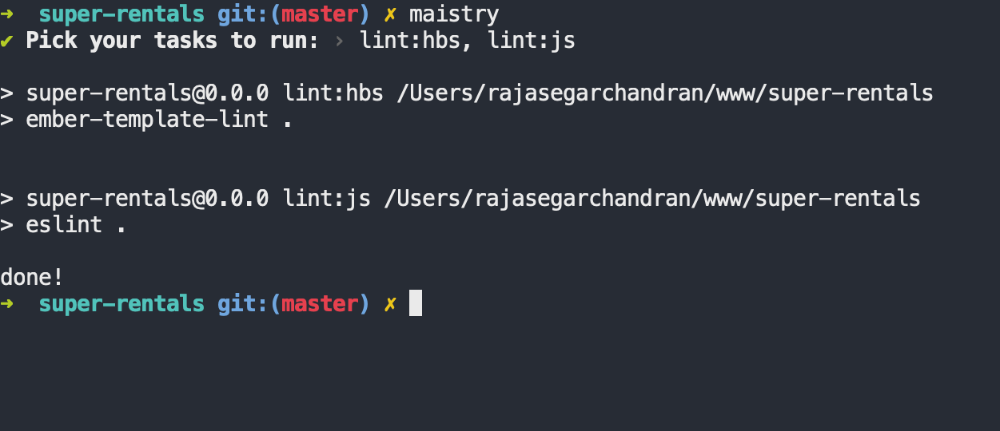

# maistry

A master workman; a foreman for your npm scripts.

## Features

- List all project scripts to choose and run
- Select multiple scripts and run
- Create/Combine new scripts from existing ones  and add them to package.json
- Use npm-run-all to run tasks parallel/sequential

## Install

```
npm install -g maistry
```

## Usage
```
maistry
```





## Help

```
maistry

Options:
  --stdout        Specify stdout for output
  --parallel, -p  Run tasks in parallel                         [default: false]
  --create, -c    Create / Combine new tasks from existing ones
  -h, --help      Show help                                            [boolean]
  -v, --version   Show version number                                  [boolean]
```
